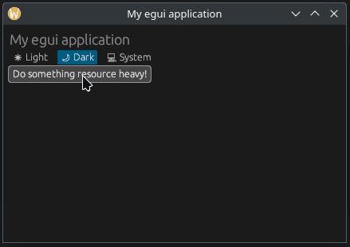

# egui-modal-spinner
[](https://crates.io/crates/egui-modal-spinner)
[](https://docs.rs/egui-modal-spinner)
[](https://github.com/fluxxcode/egui-modal-spinner/blob/master/LICENSE)

This crate implements a modal spinner for [egui](https://github.com/emilk/egui) to suppress user input. \
This is useful, for example, when performing resource-intensive tasks that do
not require the user to interact with the application.



# Example
See [sandbox](https://github.com/fluxxcode/egui-modal-spinner/tree/master/examples/sandbox) for the full example.

The following example shows the basic use of the spinner with [eframe](https://github.com/emilk/egui/tree/master/crates/eframe).

Cargo.toml:
```toml
[dependencies]
eframe = "0.30"
egui-modal-spinner = "0.2.0"
```

main.rs:
```rust
use std::sync::mpsc;
use std::thread;

use eframe::egui;
use egui_modal_spinner::ModalSpinner;

struct MyApp {
    spinner: ModalSpinner,
    result_recv: Option<mpsc::Receiver<bool>>,
}

impl MyApp {
    pub fn new(_cc: &eframe::CreationContext) -> Self {
        Self {
            /// >>> Create a spinner instance
            spinner: ModalSpinner::new(),
            result_recv: None,
        }
    }
}

impl eframe::App for MyApp {
    fn update(&mut self, ctx: &egui::Context, _frame: &mut eframe::Frame) {
        egui::CentralPanel::default().show(ctx, |ui| {
            if ui.button("Download some data").clicked() {
                // Create a new thread to execute the task
                let (tx, rx) = mpsc::channel();
                self.result_recv = Some(rx);

                thread::spawn(move || {
                    // Do some heavy resource task
                    thread::sleep(std::time::Duration::from_secs(5));

                    // Send some thread status to the receiver
                    let _ = tx.send(true);
                });

                // >>> Open the spinner
                self.spinner.open();
            }

            if let Some(rx) = &self.result_recv {
                if let Ok(_) = rx.try_recv() {
                    // >>> Close the spinner when the thread finishes executing the task
                    self.spinner.close()
                }
            }

            // >>> Update the spinner
            self.spinner.update(ctx);

            // Alternatively, you can also display your own UI below the spinner.
            // This is useful when you want to display the status of the currently running task.
            self.spinner.update_with_content(ctx, |ui| {
                ui.label("Downloading some data...");
            })
        });
    }
}
```

# Configuration
The following example shows the possible configuration options.
```rust
use egui_modal_spinner::ModalSpinner;

let spinner = ModalSpinner::new()
    .id("My custom spinner")
    .fill_color(egui::Color32::BLUE)
    .fade_in(false)
    .fade_out(true)
    .spinner_size(40.0)
    .spinner_color(egui::Color32::RED)
    .show_elapsed_time(false);
```
